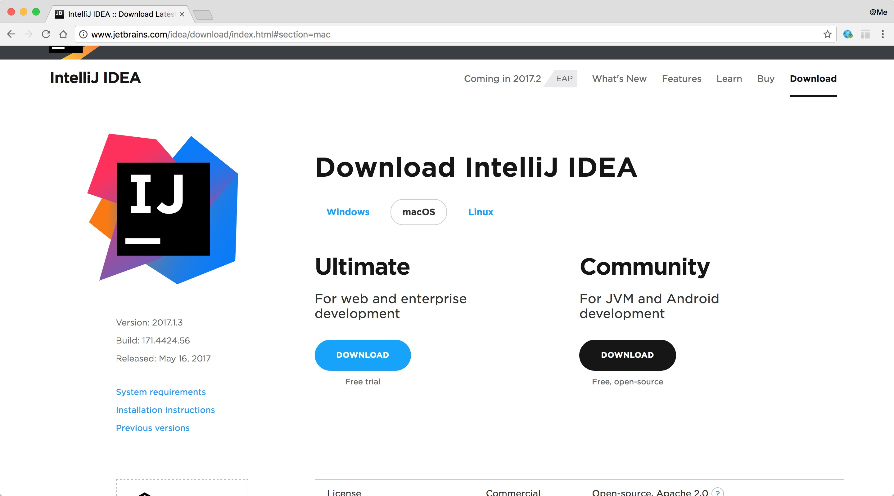

# 环境搭建

- 下载[IntelliJ IDEA](http://www.jetbrains.com/idea/download/index.html) 开发工具，选择`Ultimate`版本的就👌，这个版本更加全面，支持web开发

## ItelliJ IDEA 基本配置

### 参考文献

- [入手IntelliJ IDEA 常用配置](http://www.cnblogs.com/wwyz/p/5640412.html)  
- [IntelliJ IDEA 常用配置](http://blog.csdn.net/u013806366/article/details/52275016)  
